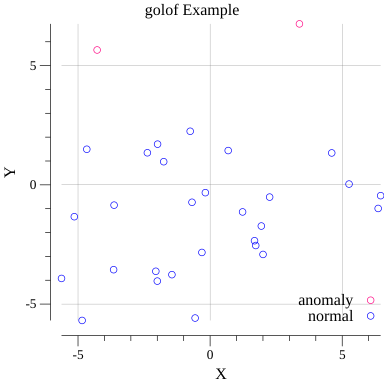

# golof
A Local Outlier Factor algorithm (Markus M. Breunig) implementation in Go.
Forked from [oopcode/golof](https://github.com/oopcode/golof)

This implementation allows you to choose between updating nearest
neighbors for all the samples *or* updating nearest neighbors only for
nearest neighbors of the added sample.

# Install 

```

go get github.com/twsnmp/golof

```

# Example

Generate a slice of `float64` points:

``` go
points := [][]float64{
    {-4.8447532242074978, -5.6869538132901658},
    {1.7265577109364076, -2.5446963280374302},
    {-1.9885982441038819, 1.705719643962865},
    {-1.999050026772494, -4.0367551415711844},
    {-2.0550860126898964, -3.6247409893236426},
    {-1.4456945632547327, -3.7669258809535102},
    {-4.6676062022635554, 1.4925324371089148},
    {-3.6526420667796877, -3.5582661345085662},
    {6.4551493172954029, -0.45434966683144573},
    {-0.56730591589443669, -5.5859532963153349},
    {-5.1400897823762239, -1.3359248994019064},
    {5.2586932439960243, 0.032431285797532586},
    {6.3610915734502838, -0.99059648246991894},
    {-0.31086913190231447, -2.8352818694180644},
    {1.2288582719783967, -1.1362795178325829},
    {-0.17986204466346614, -0.32813130288006365},
    {2.2532002509929216, -0.5142311840491649},
    {-0.75397166138399296, 2.2465141276038754},
    {1.9382517648161239, -1.7276112460593251},
    {1.6809250808549676, -2.3433636210337503},
    {0.68466572523884783, 1.4374914487477481},
    {2.0032364431791514, -2.9191062023123635},
    {-1.7565895138024741, 0.96995712544043267},
    {3.3809644295064505, 6.7497121359292684},
    {-4.2764152718650896, 5.6551328734397766},
    {-3.6347215445083019, -0.85149861984875741},
    {-5.6249411288060385, -3.9251965527768755},
    {4.6033708001912093, 1.3375110154658127},
    {-0.685421751407983, -0.73115552984211407},
    {-2.3744241805625044, 1.3443896265777866},
}

```

Convert them to `ISample` slice (`golof` works with `ISample` interface, see `lof/samples.go`
for details):

``` go

samples   := lof.GetSamplesFromFloat64s(points)

```

Get a trained `LOF` type value:

``` go

lofGetter := lof.NewLOF(5)
lofGetter.Train(samples)

```

Obtain and print a mapping from samples to their `LOF` values:

``` go

mapping   := lofGetter.GetLOFs(samples, "fast")
for sample, factor := range mapping {
    fmt.Printf("Sample: %v,  \tLOF: %f\n", sample.GetPoint(), factor)
}

```
The second argument to `GetLOFs()`, namely `"fast"`, tells `LOF` that we
want to update the KNN table only for those samples that are the new
sample's nearest neighbors. If you want to perform a full update each
time, change `"fast"` to `"strict"`.

Expected output:

``` go 

Sample: [-2.3744241805625044 1.3443896265777866],       LOF: 1.428066
Sample: [-4.844753224207498 -5.686953813290166],        LOF: 0.765557
Sample: [1.7265577109364076 -2.54469632803743],         LOF: 1.436116
Sample: [-1.9885982441038819 1.705719643962865],        LOF: 1.518616
Sample: [-1.999050026772494 -4.036755141571184],        LOF: 1.128372
Sample: [-2.0550860126898964 -3.6247409893236426],      LOF: 1.184858
Sample: [-1.4456945632547327 -3.76692588095351],        LOF: 1.159083
Sample: [-4.667606202263555 1.4925324371089148],        LOF: 1.507649
Sample: [-3.6526420667796877 -3.558266134508566],       LOF: 0.963004
Sample: [6.455149317295403 -0.45434966683144573],       LOF: 1.950348
Sample: [-0.5673059158944367 -5.585953296315335],       LOF: 1.310592
Sample: [-5.140089782376224 -1.3359248994019064],       LOF: 1.516363
Sample: [5.258693243996024 0.032431285797532586],       LOF: 1.818367
Sample: [6.361091573450284 -0.9905964824699189],        LOF: 1.902978
Sample: [-0.31086913190231447 -2.8352818694180644],     LOF: 1.410723
Sample: [1.2288582719783967 -1.1362795178325829],       LOF: 1.455256
Sample: [-0.17986204466346614 -0.32813130288006365],    LOF: 1.403039
Sample: [2.2532002509929216 -0.5142311840491649],       LOF: 1.684117
Sample: [-0.753971661383993 2.2465141276038754],        LOF: 1.668804
Sample: [1.938251764816124 -1.7276112460593251],        LOF: 1.542820
Sample: [1.6809250808549676 -2.3433636210337503],       LOF: 1.445668
Sample: [0.6846657252388478 1.4374914487477481],        LOF: 1.712357
Sample: [2.0032364431791514 -2.9191062023123635],       LOF: 1.456276
Sample: [-1.756589513802474 0.9699571254404327],        LOF: 1.406158
Sample: [3.3809644295064505 6.749712135929268],         LOF: 2.458342
Sample: [-4.27641527186509 5.6551328734397766],         LOF: 2.128373
Sample: [-3.634721544508302 -0.8514986198487574],       LOF: 1.149214
Sample: [-5.6249411288060385 -3.9251965527768755],      LOF: 0.901403
Sample: [4.603370800191209 1.3375110154658127],         LOF: 1.843948
Sample: [-0.685421751407983 -0.7311555298421141],       LOF: 1.310516

```



Red point is annomaly(factor > 1.5)

The full example can be found in [here](./examples/).


